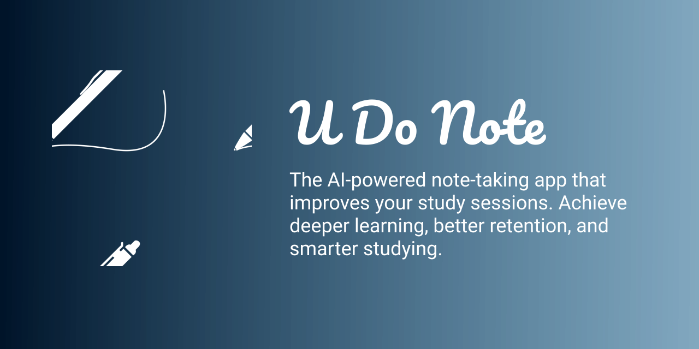

# U Do Note

## About

*U Do Note* is an AI-powered note-taking app currently under development as part of an undergraduate capstone project by students from [Cavite State University - Bacoor Campus](https://cvsu.edu.ph/bacoor/). The app is being developed by [Jiseeeh](https://www.facebook.com/Jiseeeh/), [Marc](https://www.facebook.com/santosmarc14), and [Zy](https://www.facebook.com/santosmarc14), under the guidance of our technical [adviser](https://www.facebook.com/) and [critic](https://www.facebook.com/) using **Flutter** and **Firebase**.

## Features

- Ten Learning methods
- Generates notes summary
- Note analysis
- Scan text from image using OCR
- Scan PDF and DOCX files
- Available in English and Filipino
- and MORE

## License

[MIT](https://choosealicense.com/licenses/mit/)
